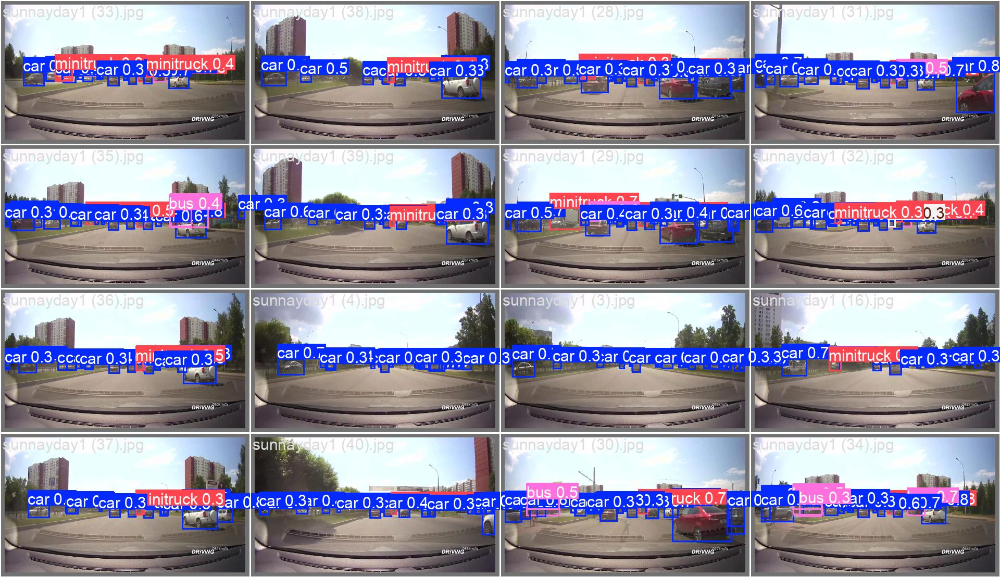
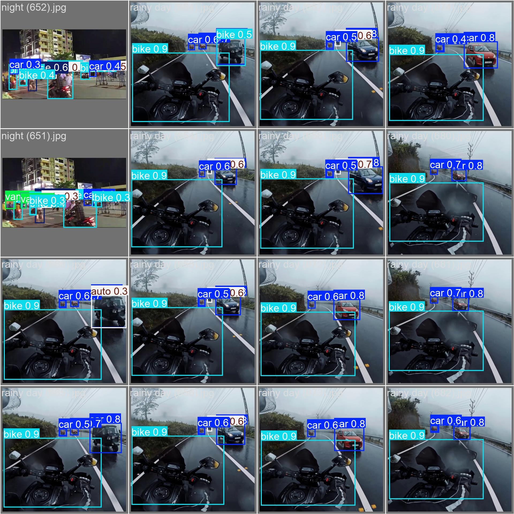
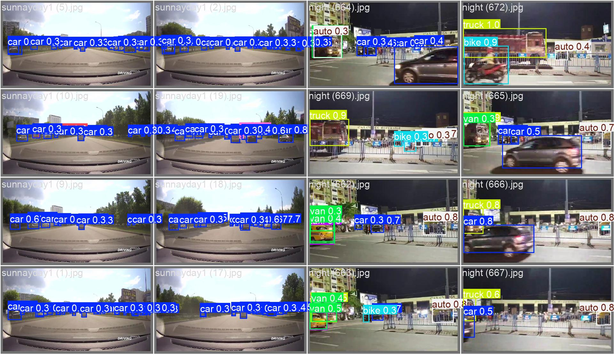
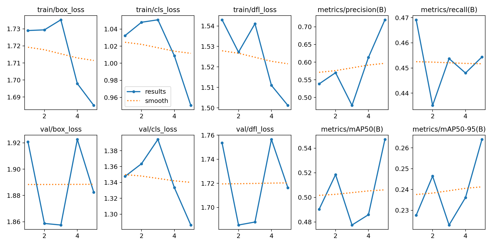

# ICDEC 2024 Vehicle Detection Challenge

## 🚗 Challenge Overview

Welcome to our submission for the ICDEC 2024 Vehicle Detection in Various Weather Conditions (VDVWC) Challenge! This repository contains our innovative approach to detecting vehicles across diverse weather and lighting conditions.

### 🎯 Objective

To develop a robust vehicle detection model that performs accurately across various weather conditions, improving upon existing methods that primarily focus on natural weather scenarios.

## 📊 Dataset

We utilized the AVD-Dataset, comprising 3,200 images of vehicles in various weather conditions:

- 2,600 images for training
- 200 images for validation
- Annotations provided in YOLO format

**Dataset Link**: [AVD-Dataset](https://github.com/Sourajit-Maity/juvdv2-vdvwc.git)

## 🛠 Methodology

Our approach leverages state-of-the-art deep learning techniques, specifically:

1. **YOLOv8**: We employed the latest YOLOv8 architecture, known for its speed and accuracy in object detection tasks.
2. **Custom Augmentations**: Implemented extensive data augmentation to simulate various weather conditions.
3. **Transfer Learning**: Utilized pre-trained weights and fine-tuned on the AVD-Dataset.
4. **Hyperparameter Optimization**: Conducted thorough hyperparameter tuning to maximize model performance.

### Multi-Stage Training Strategy

1. **Stage 1 - Sunny Conditions** (20 epochs):
   - Initial training using only images captured in sunny conditions.
   - This stage helps the model learn basic features and object representations in ideal lighting conditions.
   
2. **Stage 2 - Full Dataset** (20 epochs):
   - Fine-tuning on the entire dataset, including all weather conditions.
   - This stage exposes the model to diverse weather scenarios, improving its generalization capabilities.
   
3. **Stage 3 - Final Refinement** (5 epochs):
   - A short fine-tuning phase on the full dataset.
   - This stage helps in final adjustments and stabilization of the model's performance across all conditions.

### Hyperparameter Tuning

We conducted thorough hyperparameter tuning at each stage to maximize model performance:

- **Training Parameters**:
  - **Image Size**: 800
  - **Batch Size**: 16
  - **Epochs**: 5 (Final Refinement)
  - **Learning Rate**: Initial: 0.01, Final: 0.01
  - **Momentum**: 0.937
  - **Weight Decay**: 0.0005
  - **Warmup Epochs**: 3
  - **Warmup Momentum**: 0.8
  - **Warmup Bias Learning Rate**: 0.1

- **Augmentation Parameters**:
  - **Degrees**: 10
  - **Translate**: 0.1
  - **Scale**: 0.5
  - **Shear**: 0.1
  - **Perspective**: 0.0005
  - **Flip Up-Down**: 0.5
  - **Flip Left-Right**: 0.5
  - **Mosaic**: 0.5
  - **MixUp**: 0.5
  - **Copy-Paste**: 0.3
  - **HSV-Hue**: 0.015
  - **HSV-Saturation**: 0.7
  - **HSV-Value**: 0.4

- **Loss Function Parameters**:
  - **Box Loss Gain**: 7.5
  - **Class Loss Gain**: 0.5
  - **DFL Loss Gain**: 1.5

- **Other Parameters**:
  - **Overlap Mask**: True
  - **Mask Ratio**: 4
  - **Patience**: 50
  - **Cache**: False (Set to True if enough RAM)

## 📈 Results

Our model achieved the following performance metrics on the validation set:

- mAP: 0.573
- F1-Score: 0.52

### Visualizations

#### Confusion Matrix and F1 Curve

<div style="display: flex; justify-content: space-around;">
  
  
</div>

#### Sample Detection Outputs


*Fig 1. Detection results on a sunny day.*


*Fig 2. Detection results in rainy conditions.*


*Fig 3. Detection results at night.*

#### Performance Graphs


*Fig 4. Results .*

### How to Use

To use the final model for validation, follow these steps:

1. **Load the Model**:
    ```python
    model = torch.load('final_stage/weights/best.pt')
    ```

2. **Validate the Model**:
    ```python
    results = model.val(data='path/to/your/validation/dataset')
    print(results)
    ```

Replace `'path/to/your/validation/dataset'` with the actual path to your validation dataset.

This snippet loads the trained model from the specified path and evaluates its performance on the validation dataset.


## 📜 Conclusion

Our multi-stage training approach, combined with extensive data augmentation and rigorous hyperparameter tuning, has enabled us to develop a robust vehicle detection model capable of performing well across various weather conditions. We believe this methodology can significantly contribute to advancements in the field of object detection under diverse environmental scenarios.

---


For further details, please refer to our full documentation and code in the repository. Feel free to reach out if you have any questions or need additional information.

- Prakrititz Borah: prakrititz.borah@iiitb.ac.in
- Areen Patil: areenjadhavpatiil@gmail.com
- Aahana Patil: aahanapatil18@gmail.com


Thank you for considering our submission for the ICDEC 2024 VDVWC Challenge!
